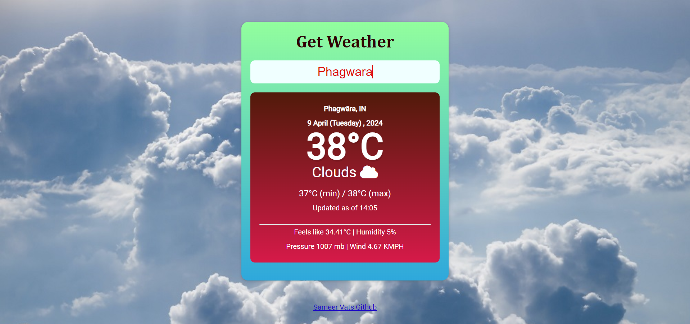
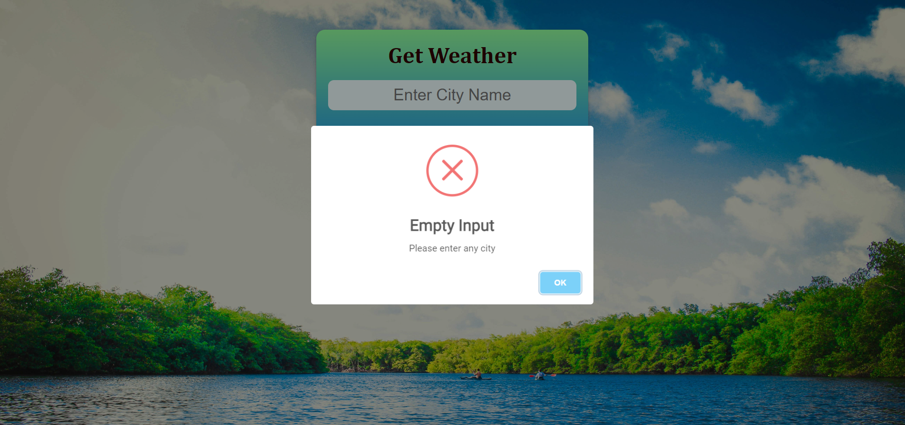

# Weather_webApp

## I used open weather API to fetch data 

### This web project is done in html,css,js

#### Web link 
https://weather-app-sameer.vercel.app/
 
 #### Github link
 
 
### Features of the project.

* It provide dynamic weather data like temp, min max temp etc.
* Dynamic background images change according to weather status.
* Dynamic weather icon change according to weather status.
* It provide basic information like feels like temperature,humidity,pressure,wind speed.
* It will not accept empty input.
* it will give you alert if city name not matched with api data.
* a good ux/ui 

### Snapshot

* Default 

* when you entered any valid city
 

* when you didn't entered anything 
 

* when entered city didn't matched with data
 

